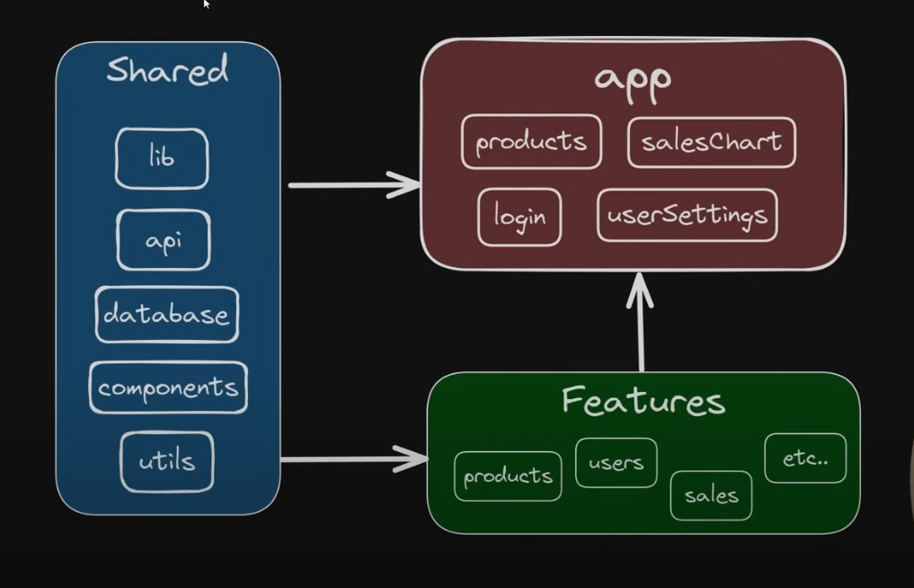

# Mini Notion Like Task Management App 📑

## Demo

## Live App(Give a try😎): [https://codesandbox.io/p/github/anjaysahoo/advance-todo-list/master](https://codesandbox.io/p/github/anjaysahoo/advance-todo-list/master)
Please log in with your GitHub account to see the updated code preview from above URL
## Features

### Core
- ✅ Task Listing
- ✅ Adding tasks
- ✅ Sorting/Filtering
- ✅ Pagination
- ✅ Editing/Deleting tasks
- ✅ Persistence with localStorage
- ✅ Mange Custom Fields
  - Add Field [Supporting field type: text, number, checkbox]
  - Delete Field

### Others[_Coming Soon_ 🫣]

- 🏗️ Animation & Transistion
- 🏗️ Undo / Redo
- 🏗️ Multiselect bulk action
- 🏗️ Kanban View

## Tech Stack Used
- React v19
- Vite
- Typescript
- React Hook Form + Zod [Form Handling]
- Redux [State Management]
- ShadCn [UI Library] (Talwind CSS, Lucid React)
- Axios [HTTP Client]

## Folder Structure Followed

For more details: [https://www.youtube.com/watch?v=xyxrB2Aa7KE](https://codesandbox.io/p/github/anjaysahoo/advance-todo-list/master)

There is a `Global` folder that holds all the shared stuff, and there is `Feature` folder
that now holds `Task` feature and all the related files for it.

## Implementation Details

There are total two important states that are driving whole app:
1. Task State: Which stores all the tasks
2. Custom Field State: Which stores all the custom fields 

In these two states, we do our CRUD operation from different components.

Currently, on first load of app it loads task from [https://gist.githubusercontent.com/yangshun/7acbe005af922e43a26dea8109e16aed/raw/01df391c8320df0a37c73fdbf6b8fc7d88aae719/greatfrontend-tasks.json](https://codesandbox.io/p/github/anjaysahoo/advance-todo-list/master)
and after that it stores all the task on local storage and does all CRUD operation on that. All 
subsequent load of app will load task from local storage.

## Further Improvement

- More robust Typescript implementation
- Enhancing more on Zod implementation
- Husky to enforce strict linting while committing code 
- Use Eslint-boundaries to enforce better folder structure
- Handling loading and updating task through API with infinite scroll
- Coming up with more features like we have in Notion
